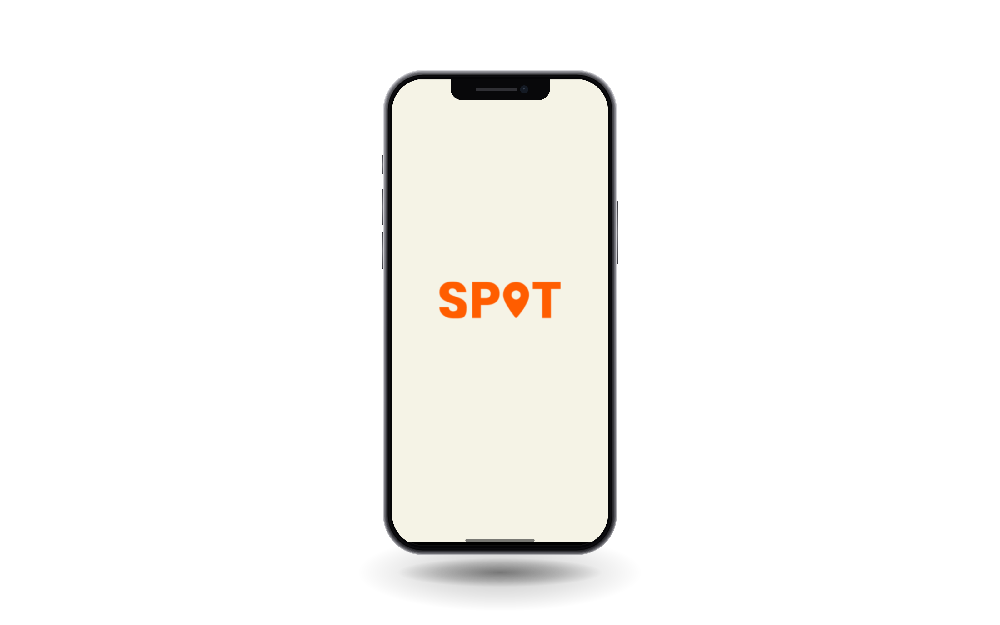
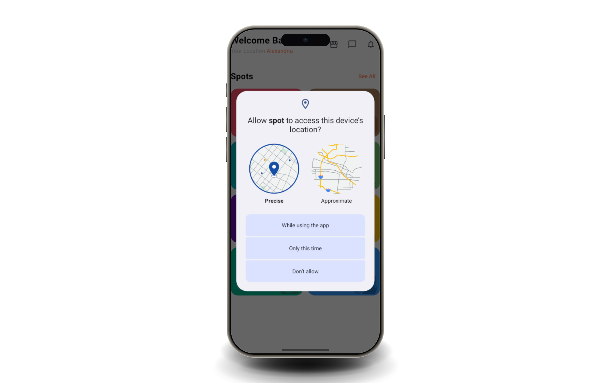
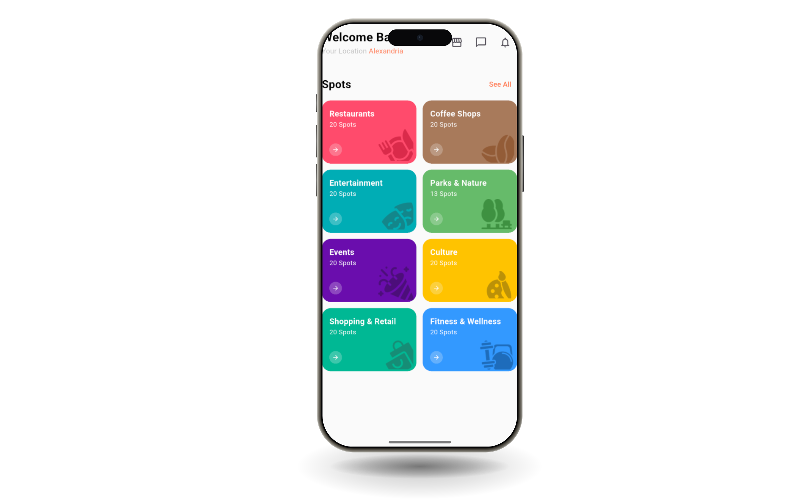
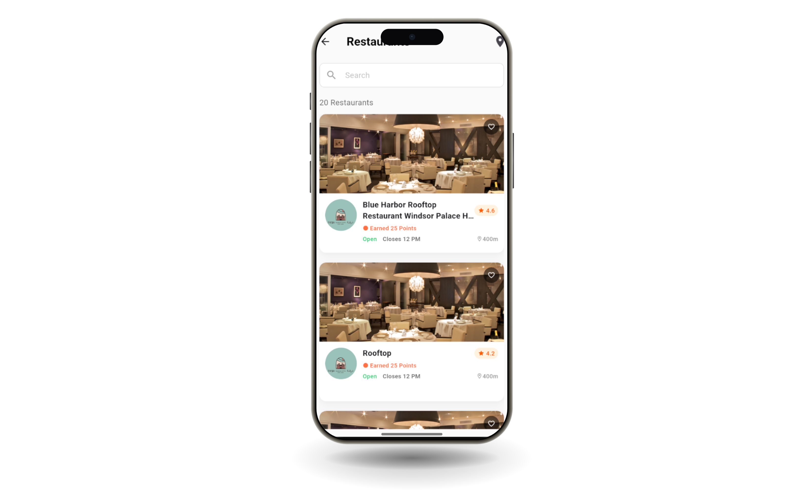
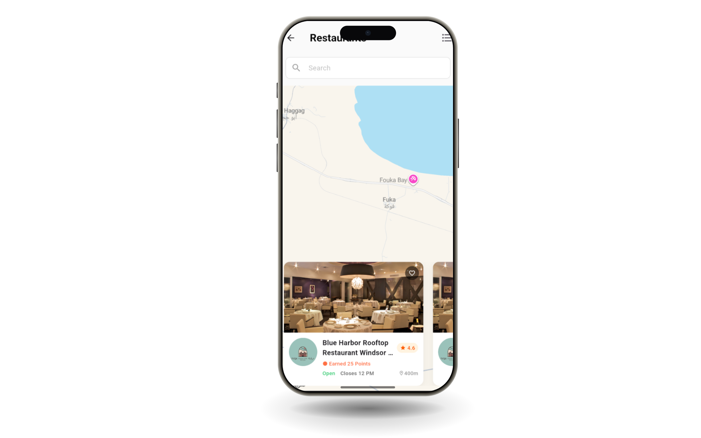
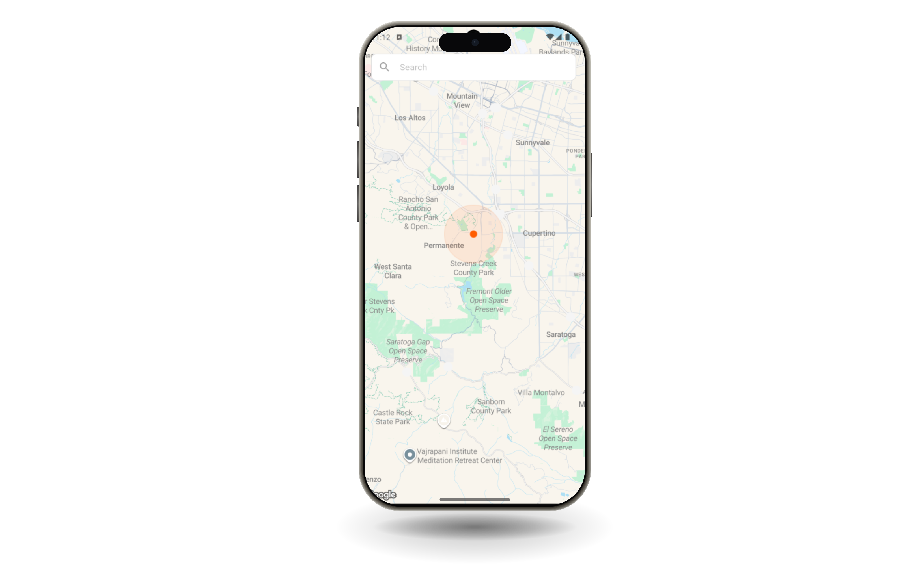
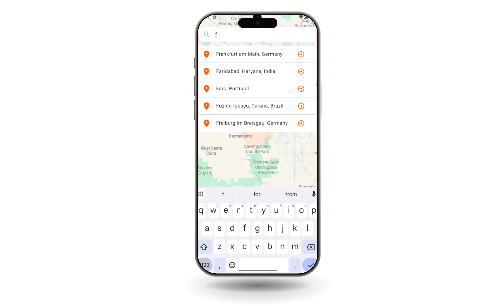

<div align="center">

# Spot 📍

### *Discover what's around you.*

A location-based Flutter app powered by the Google Maps API — find restaurants, coffee shops, parks, events and more, near you, in a clean colorful interface.

[](https://flutter.dev)
[](https://dart.dev)
[](https://developers.google.com/maps)
[](https://bloclibrary.dev)

</div>

---

## 📖 Table of Contents

- [About](#about)
- [Features](#features)
- [Roadmap](#roadmap)
- [Tech Stack](#tech-stack)
- [Screenshots](#screenshots)
- [Getting Started](#getting-started)
- [Contributing](#contributing)
- [Connect](#connect)

---

## About

**Spot** is a Flutter application that helps users discover places around them. Using the Google Maps API, it lets you browse **500+ nearby locations** across multiple categories, switch between a list view and an interactive map view, and search for any city in the world.

---

## Features

| Feature | Description |
|---|---|
| 📍 **Location Access** | Requests precise or approximate device location to show what's around you |
| 🗂️ **Place Categories** | 8 categories: Restaurants, Coffee Shops, Entertainment, Parks & Nature, Events, Culture, Shopping & Retail, Fitness & Wellness |
| 📋 **List View** | Browse places with photo, name, rating, open/closed status and distance |
| 🗺️ **Map View** | See places on Google Maps with a horizontal card carousel below the map |
| 🔎 **Search** | Search places and cities with live autocomplete suggestions |
| 🧭 **Current Location** | Your live position is shown on the map |
| 🌍 **500+ Places** | Nearby places fetched from the Google Maps API |

---

## Roadmap

These features have UI in place and are planned for upcoming releases:

- [ ] Login / Register
- [ ] Points & rewards system
- [ ] Favorites
- [ ] Chat
- [ ] Notifications
- [ ] Store
- [ ] Location-based filtering algorithm (distance & category)

---

## Tech Stack

| Layer | Technology |
|---|---|
| **Framework** | Flutter / Dart |
| **Maps & Places** | Google Maps API |
| **State Management** | Cubit (flutter_bloc) |
| **Architecture** | MVVM |

---

**Data Flow:**
```
View (UI) → Cubit (ViewModel) → Repository → Google Maps API
```

---

## Screenshots

<div align="center">

| Splash | Location Permission | Home |
|:---:|:---:|:---:|
|  |  |  |

| List View | Map View | Current Location |
|:---:|:---:|:---:|
|  |  |  |

| City Search |
|:---:|
|  |

</div>

---

## Getting Started

### Prerequisites

- [Flutter SDK](https://docs.flutter.dev/get-started/install) (latest stable)
- Android Studio / VS Code
- A Google Cloud project with the Maps SDK (and Places API) enabled, plus an API key

### Installation

1. **Clone the repository:**
   ```bash
   git clone https://github.com/hatemf934/spot.git
   cd spot
   ```

2. **Install dependencies:**
   ```bash
   flutter pub get
   ```

3. **Add your Google Maps API key:**
   - Android: add it to `android/app/src/main/AndroidManifest.xml`
   - iOS: add it to `ios/Runner/AppDelegate.swift`

4. **Run the app:**
   ```bash
   flutter run
   ```

---

## Contributing

Contributions are welcome! For major changes, please open an issue first to discuss what you'd like to change.

1. Fork the repository
2. Create your feature branch:
   ```bash
   git checkout -b feature/AmazingFeature
   ```
3. Commit your changes:
   ```bash
   git commit -m 'Add some AmazingFeature'
   ```
4. Push to the branch:
   ```bash
   git push origin feature/AmazingFeature
   ```
5. Open a Pull Request

---

## Connect

| | |
|---|---|
| GitHub | [github.com/hatemfathy](https://github.com/hatemf934) |
| LinkedIn | [linkedin.com/in/hatemfathy16](https://www.linkedin.com/in/hatemfathy16/) |
| Gmail | [hatemf934@gmail.com](mailto:hatemf934@gmail.com) |

---

<div align="center">
  <sub>Built with ❤️ using Flutter</sub>
</div>
